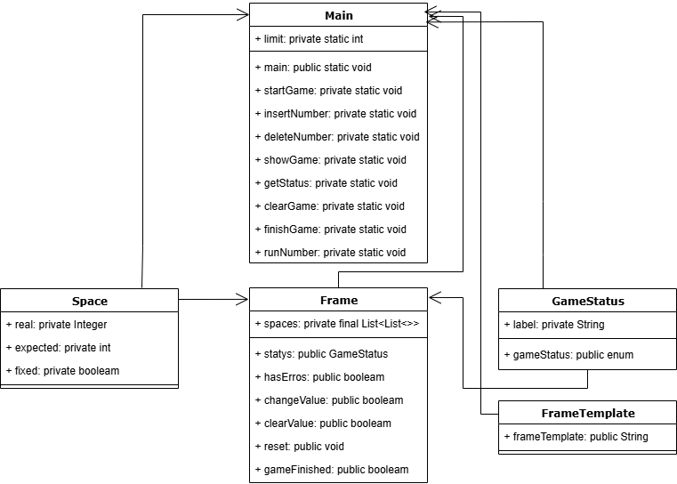
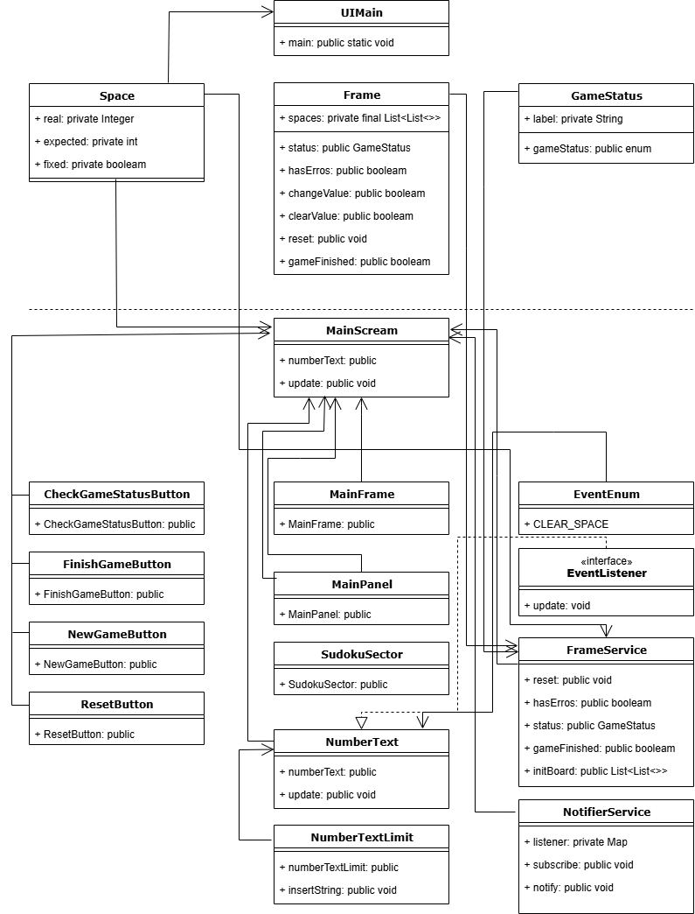

# Criando um Banco Digital com Java e Orientação a Objetos

Criação de projeto para projeto de jogo de Sudoku de 9 posições. 
Implementação da composição do quadro de forma aleatória permitindo várias possibilidades de jogos e níveis de dificuldade diferenciados

## Campos
### Space

| Campo      | Tipo      | exemplo | Origem da Informação |
|:-----------|:----------|:--------|----------------------|
| `real`     | `Integer` | 1       | `Aplicação`          |
| `expected` | `int`     | 1       | `Aplicação + args`   |
| `fixed`    | `int`     | Centro  | `Aplicação + args`   |
|

### GameStatus

| Campo      | Tipo       | exemplo       | Origem da Informação |
|:-----------|:-----------|:--------------|----------------------|
| `labek`    | `String`   | Jogo iniciado | `Aplicação`          |

## Parâmetros
Os seguintes parâmetros são necessários para rodar a aplicação:
0,0;5,true 1,0;3,true 2,0;4,false 3,0;6,false 4,0;7,true 5,0;8,false 6,0;9,false 7,0;1,false 8,0;2,false 0,1;6,true 1,1;7,false 2,1;2,false 3,1;1,true 4,1;9,true 5,1;5,true 6,1;3,false 7,1;4,false 8,1;8,false 0,2;1,false 1,2;9,true 2,2;8,true 3,2;3,false 4,2;4,false 5,2;2,false 6,2;5,false 7,2;6,true 8,2;7,false 0,3;8,true 1,3;5,false 2,3;9,false 3,3;7,false 4,3;6,true 5,3;1,false 6,3;4,false 7,3;2,false 8,3;3,true 0,4;4,true 1,4;2,false 2,4;6,false 3,4;8,true 4,4;5,false 5,4;3,true 6,4;7,false 7,4;9,false 8,4;1,true 0,5;7,true 1,5;1,false 2,5;3,false 3,5;9,false 4,5;2,true 5,5;4,false 6,5;8,false 7,5;5,false 8,5;6,true 0,6;9,false 1,6;6,true 2,6;1,false 3,6;5,false 4,6;3,false 5,6;7,false 6,6;2,true 7,6;8,true 8,6;4,false 0,7;2,false 1,7;8,false 2,7;7,false 3,7;4,true 4,7;1,true 5,7;9,true 6,7;6,false 7,7;3,false 8,7;5,true 0,8;3,false 1,8;4,false 2,8;5,false 3,8;2,false 4,8;8,true 5,8;6,false 6,8;1,false 7,8;7,true 8,8;9,true

## Fluxograma
### Fluxograma Java

### Fluxograma interface Java Swing

## Linguagens utilizadas
- Java Versão 21.0.7

## Referências
- [DIO - Sudoku](https://github.com/digitalinnovationone/sudoku)
- [DIO - Trilha Java básico](https://github.com/digitalinnovationone/exercicios-java-basico/blob/main/projetos/2%20-%20Programa%C3%A7%C3%A3o%20Orientada%20a%20Objetos%20e%20Estruturas%20de%20Dados%20com%20Java.md)

## Autores

- [@Anderson-G-Silva](https://github.com/Anderson-G-Silva)

